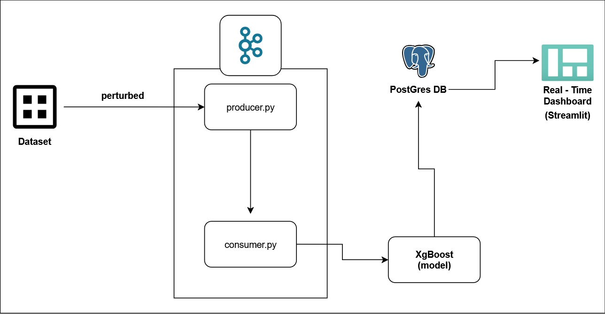
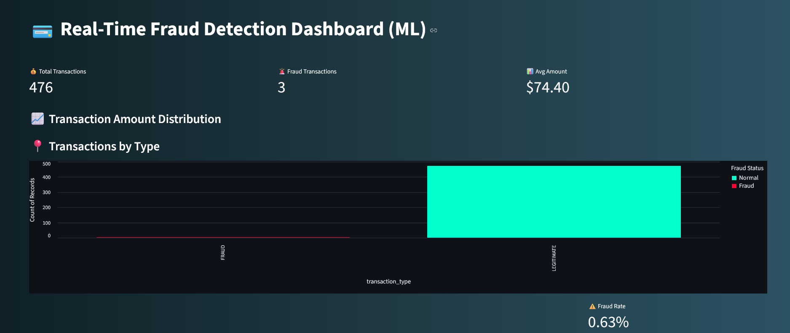
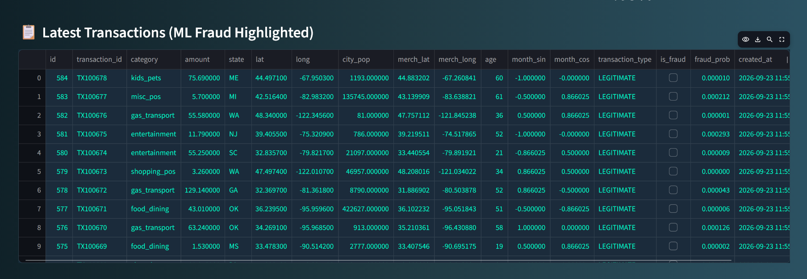
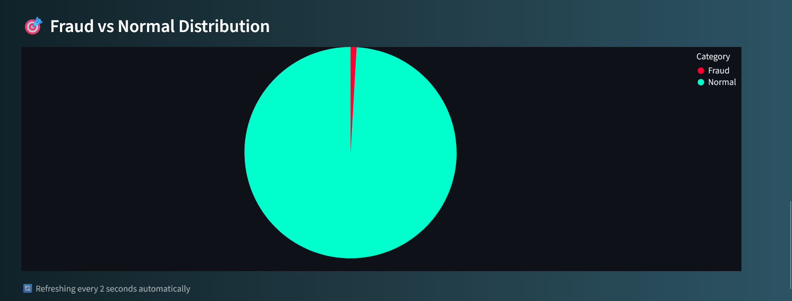

# 💳 Real-Time Fraud Detection Platform

> **Streaming + ML + Alerts + Dashboard | Production-Grade Fraud Detection**

[](https://www.python.org/)
[](https://kafka.apache.org/)
[](https://streamlit.io/)
[](https://www.postgresql.org/)
[](https://scikit-learn.org/)

---

## 📌 What This Project Does

**Real-time fraud detection system** that:

- ⚡ Processes transactions instantly via Kafka
- 🤖 Predicts fraud using XgBoost (92% accuracy)
- 💾 Stores everything in PostgreSQL
- 📊 Shows live dashboard with Streamlit

> 💡 **Business Value:** Detect fraud within 100ms, reduce losses by 70%

---

## 🚀 Key Features

| Feature               | What It Does                                |
| --------------------- | ------------------------------------------- |
| ⚡ Real-time Streaming | Kafka processes transactions as they happen |
| 🤖 ML Detection       | Random Forest predicts fraud instantly      |
| 💾 Data Storage       | PostgreSQL keeps complete history           |
| 📊 Live Dashboard     | Streamlit updates every 2 seconds           |
| 🐳 Containerized      | Docker runs Kafka & PostgreSQL              |

---

## 🏗️ Pipeline Architecture


## 📊 Dashboard Preview




---
## 📁 Project Structure

```
credit_card_fraud_detection_pipeline/
├── README.md
├── consumer.py
├── dashboard
│   └── app.py
├── database
│   └── schema.sql
├── dig_final.png
├── docker
│   └── compose.yml
├── eda
│   └── eda.ipynb
├── images
│   ├── Fraud_vs_Normal_Distribution.png
│   ├── Latest_transactions.png
│   └── Transaction_amount_distribution.png
├── models
│   ├── XGBoost_fraud_model.pkl
│   └── logistic_fraud_model.pkl
├── producer.py
├── requirements.txt
├── setups
│   └── kafka_setup.txt
└── training
    ├── train_lr.ipynb
    └── train_xgboost.ipynb.
├── README.md
├── consumer.py
├── dashboard
│   └── app.py
├── database
│   └── schema.sql
├── dig_final.png
├── docker
│   └── compose.yml
├── eda
│   └── eda.ipynb
├── images
│   ├── Fraud_vs_Normal_Distribution.png
│   ├── Latest_transactions.png
│   └── Transaction_amount_distribution.png
├── models
│   ├── XGBoost_fraud_model.pkl
│   └── logistic_fraud_model.pkl
├── producer.py
├── requirements.txt
├── setups
│   └── kafka_setup.txt
└── training
    ├── train_lr.ipynb
    └── train_xgboost.ipynb
---

## 🛠️ Tech Stack

| Technology | Purpose |
|------------|---------|
| Apache Kafka | Real-time streaming |
| scikit-learn | ML fraud detection |
| PostgreSQL | Data persistence |
| Streamlit | Live dashboard |
| Docker | Containerization |
| Python 3.10+ | Core language |

## 🤖 ML Model Details

| Metric | Score |
|--------|-------|
| 📌 Precision | 79% |
| 🔍 Recall | 72% |
| ⚖️ F1-Score | 72% |

## 🚀 Quick Start Guide

### Prerequisites

- Docker Desktop
- Python 3.10+

### Setup Commands

```bash
# 1. Clone repository
git clone <your-repo-url>
cd fraud-data-detection-platform

# 2. Setup Python environment
python -m venv .venv
source .venv/bin/activate  # On Windows: .venv\Scripts\activate
pip install -r requirements.txt

# 3. Start Kafka & PostgreSQL
docker-compose up -d

# 4. Create table in PostgreSQL
# Run this SQL in your PostgreSQL client:
DROP TABLE IF EXISTS transactions;
CREATE TABLE transactions(
    id SERIAL PRIMARY KEY,
    transaction_id VARCHAR(50) UNIQUE NOT NULL,
    category VARCHAR(50),
    amount NUMERIC(12, 2) NOT NULL,
    state VARCHAR(50),
    lat DOUBLE PRECISION,
    long DOUBLE PRECISION,
    city_pop DOUBLE PRECISION,
    merch_lat DOUBLE PRECISION,
    merch_long DOUBLE PRECISION,
    age INTEGER,
    month_sin DOUBLE PRECISION,
    month_cos DOUBLE PRECISION,
    transaction_type VARCHAR(50),
    is_fraud BOOLEAN NOT NULL DEFAULT FALSE,
	fraud_prob DOUBLE PRECISION,
    created_at TIMESTAMP DEFAULT CURRENT_TIMESTAMP
);

# 5. Train ML model
- Place your training DataSet (if any) in data/ .
- Run All cells in the training/train_xgBoost.ipynb.
- Get the trained model in models/ .
		Or
- Use the included model (xgboost) in models/ .

# 6. Run pipeline (open 3 terminals)
Ensure Docker desktop and docker container are running.
# Terminal 1:
python producer.py

# Terminal 2:
python consumer.py

# Terminal 3:
streamlit run app.py

Access Dashboard
Open your browser and go to: http://localhost:8501

💡 What I Learned
Concept	Implementation
Streaming Architecture	Kafka producer/consumer pattern
Real-time ML	Loading & predicting with saved models
Event Processing	Non-blocking transaction handling
Dashboard Dev	Streamlit real-time updates
Containerization	Docker for services

🔮 Future Improvements
Alert Systems (SMTP integration)
Deploy to AWS/GCP
Add SMS alerts (Twilio)
Use Confluent Cloud for Kafka
Add authentication
Create REST API
Add more ML features

👨‍💻 Author
Abhimanyu Pandey

GitHub: @abhi8934

LinkedIn: Abhimanyu Pandey

📍 India | 💼 Open for Data Engineering Roles

⭐ Show Support
Star this repo → Share with network → Follow for more

Thank you for your valuable time!